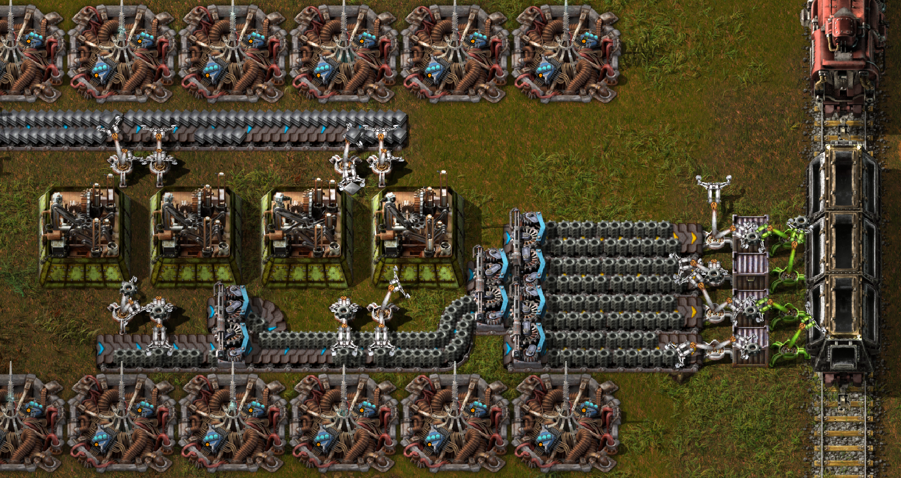

# Known issues
- Stacks are all or nothing, you cannot partially deplete a stack
- A target expecting an item can only be passed a stack by a Stack inserter
- Stack inserters can end up buffering a large amount of items
- Buffered items are not returned to the player on entity deletion
- Inserter speeds aren't quite correct
- The Stack inserter itself acts as an inventory

